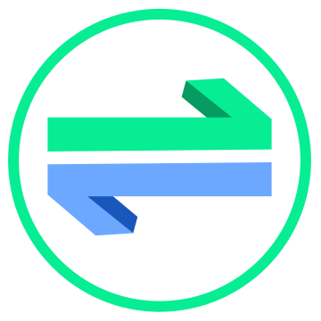
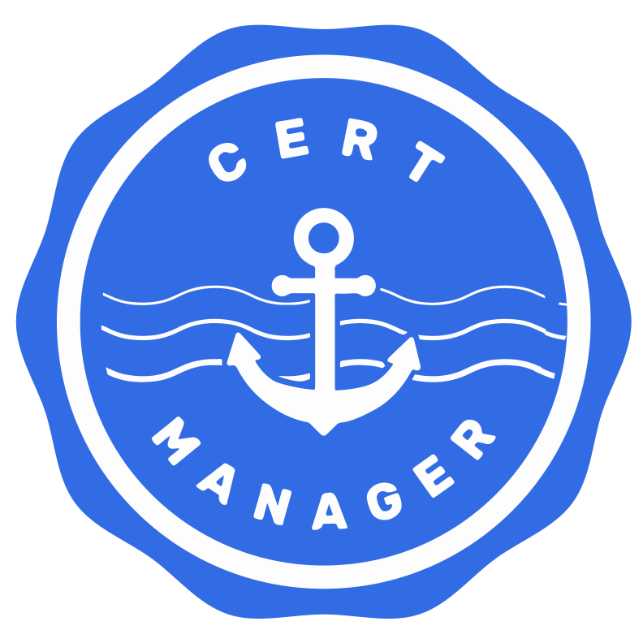
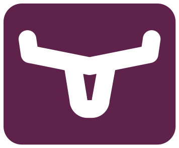

## Project Scope: PiKube Kubernetes Service

The primary goal of this project is the creation of a home-based Kubernetes cluster using ARM bare metal nodes, specifically Raspberry Pis and Orange Pis. Emphasis is placed on automation of deployment and configuration, leveraging Infrastructure as Code (IaC) and GitOps approaches. This is achieved with the help of tools like [Ansible](https://docs.ansible.com/), [cloud-init](https://cloudinit.readthedocs.io/en/latest/), and [Argo CD](https://argo-cd.readthedocs.io/en/stable/).

The project incorporates several critical services within the Kubernetes ecosystem, including:

- **Distributed Block Storage:** for POD's persistent volumes via [LongHorn](https://longhorn.io/).
- **Backup and Restore Solution:** for the cluster using [Velero](https://velero.io/) and [Restic](https://restic.net/).
- **Service Mesh Architecture:** facilitated by [Linkerd](https://linkerd.io/).
- **Observability Platform:** encompassing a metrics monitoring solution with [Prometheus](https://prometheus.io/), a logging and analytics solution via the EFK+LG stack ([Elasticsearch](https://www.elastic.co/elasticsearch/)-[Fluentd](https://www.fluentd.org/)/[Fluentbit](https://fluentbit.io/)-[Kibana](https://www.elastic.co/kibana/) + [Loki](https://grafana.com/oss/loki/)-[Grafana](https://grafana.com/oss/grafana/)), and a distributed tracing solution through [Tempo](https://grafana.com/oss/tempo/).

In addition to these services, the project project scope encompasses tools and services pivotal for exploring and understanding microservices architectures:

- **Service Mesh Architecture with [**`Linkerd`**](https://linkerd.io/):** This tool enhances service interactions, making them more secure, observable, and reliable without altering application code.

- **API Security:** Utilizing OAuth 2.0 and OpenID Connect, alongside an IAM solution like [**`Keycloak`**](https://www.keycloak.org/), ensures secure and authorized access across our services.

- **Streaming with Kafka:** [**`Kafka`**](https://kafka.apache.org/) supports real-time data streaming and inter-service communication, crucial for dynamic microservices environments.

## Design Principles

- **ARM Bare Metal Nodes:** Integration of Raspberry PI and Orange Pis nodes (ARM) within the same cluster.
- **Lightweight Kubernetes Distribution:** Adoption of [K3S](https://k3s.io/), suitable for Raspberry PI nodes due to its reduced memory requirements.
- **Distributed Block Storage Technology:** Preference for Kubernetes distributed storage solutions like [Rook/Ceph](https://rook.io/) or [Longhorn](https://longhorn.io/), with recent ARM 64-bit support.
- **Commitment to Open Source:** Utilization of projects under the [CNCF: Cloud Native Computing Foundation](https://www.cncf.io/).
- **Latest Versions for Exploration:** Utilizing the latest versions of each open-source project to explore cutting-edge Kubernetes capabilities.
- **Deployment Automation:** Using [cloud-init](https://cloudinit.readthedocs.io/en/latest/) for initial OS setup.
- **Configuration Automation:** Using [Ansible](https://docs.ansible.com/) for automating the configuration of cluster nodes, Kubernetes and external service installation, and initiation of cluster bootstrap.
- **Application Provisioning with Argo CD:** Applying [Argo CD](https://argo-cd.readthedocs.io/en/stable/) for seamless Kubernetes application provisioning from a Git repository.

## Open Source Technologies: Building the Cluster

The image below presents a comprehensive view of the open-source technologies utilized in constructing the cluster:

    

<!DOCTYPE html>
<html>
<head>
    <title>PiKube Technical Stack</title>
    
    <link href="https://fonts.googleapis.com/css2?family=Paytone+One&display=swap" rel="stylesheet">
</head>
<body>
    

        <table class="table table-white table-bordered border-dark w-auto align-middle">
            <!-- Table Header -->
            <tr>
                <th></th>
                <th></th>
                <th>Technology stack</th>
                <th>Description</th>
            </tr>
            <!-- Layer 1: Observability -->
            <tr>
                <td rowspan="8" class="vertical-cell">
                    
OBSERVABILITY

                </td>
                <td></td>
                <td><a href="https://grafana.com/oss/grafana/">Grafana</a></td>
                <td>Monitoring Dashboards.</td>
            </tr>
            <tr>
                <td></td>
                <td><a href="https://www.elastic.co/kibana/">Kibana</a></td>
                <td>Logs analytics Dashboards.</td>
            </tr>
            <tr>
                <td></td>
                <td><a href="https://www.elastic.co/elasticsearch/">Elasticsearch</a></td>
                <td>Logs analytics.</td>
            </tr>
            <tr>
                <td></td>
                <td><a href="https://grafana.com/oss/tempo/">Tempo</a></td>
                <td>Distributed tracing monitoring.</td>
            </tr>
            <tr>
                <td></td>
                <td><a href="https://prometheus.io/">Prometheus</a></td>
                <td>Metrics monitoring and alerting.</td>
            </tr>
            <tr>
                <td></td>
                <td><a href="https://www.fluentd.org/">Fluentd</a></td>
                <td>Logs forwarding and distribution.</td>
            </tr>
            <tr>
                <td></td>
                <td><a href="https://fluentbit.io/">Fluentbit</a></td>
                <td>Logs collection.</td>
            </tr>
            <tr>
                <td></td>
                <td><a href="https://grafana.com/oss/loki/">Loki</a></td>
                <td>Logs aggregation.</td>
            </tr>
            <!-- Layer 2: Automation -->
            <tr>
                <td rowspan="3" class="vertical-cell">
                    
AUTOMATION

                </td>
                <td></td>
                <td><a href="https://www.ansible.com">Ansible</a></td>
                <td>Streamlines system configuration, external service integration, and k3s cluster setup.</td>
            </tr>
            <tr>
                <td></td>
                <td><a href="https://argoproj.github.io/cd">ArgoCD</a></td>
                <td>Deploys Kubernetes applications following GitOps principles.</td>
            </tr>
            <tr>
                <td></td>
                <td><a href="https://cloudinit.readthedocs.io/en/latest/">Cloud-init</a></td>
                <td>Automates the initial configuration and setup of operating systems.</td>
            </tr>
            <!-- Layer 3: Authentication -->
            <tr>
                <td rowspan="2" class="vertical-cell">
                    
AUTHENTICATION

                </td>
                <td></td>
                <td><a href="https://www.keycloak.org/">Keycloak</a></td>
                <td>Open-source Identity and Access Management solution for modern applications and services.</td>
            </tr>
            <tr>
                <td></td>
                <td><a href="https://oauth2-proxy.github.io/oauth2-proxy/">OAuth2.0 Proxy</a></td>
                <td>A reverse proxy and static file server that provides authentication using providers like Keycloak, Google, and others.</td>
            </tr>
            <!-- Layer 4: Orchestration -->
            <tr>
                <td rowspan="2" class="vertical-cell">
                    
ORCHESTRATION

                </td>
                <td></td>
                <td><a href="https://k3s.io/">K3S</a></td>
                <td>A simplified and lightweight Kubernetes distribution.</td>
            </tr>
            <tr>
                <td></td>
                <td><a href="https://containerd.io/">containerd</a></td>
                <td>K3S-integrated runtime for container management.</td>
            </tr>
            <!-- Layer 5: Security -->
            <tr>
                <td rowspan="3" class="vertical-cell">
                    
SECURITY

                </td>
                <td></td>
                <td><a href="https://cert-manager.io">Cert-manager</a></td>
                <td>Manages TLS certificates for Kubernetes.</td>
            </tr>
            <tr>
                <td></td>
                <td><a href="https://www.vaultproject.io/">Hashicorp Vault</a></td>
                <td>Secures, stores, and tightly controls access to tokens, passwords, certificates, and other sensitive secrets in modern computing.</td>
            </tr>
            <tr>
                <td></td>
                <td><a href="https://external-secrets.io/">External Secrets Operator</a></td>
                <td>Synchronizes secrets from external APIs like Hashicorp Vault into Kubernetes.</td>
            </tr>
            <!-- Layer 6: Storage -->
            <tr>
                <td rowspan="2" class="vertical-cell">
                    
STORAGE

                <td></td>
                <td><a href="https://longhorn.io/">Longhorn</a></td>
                <td>Distributed storage solution for Kubernetes, ensuring data persistence.</td>
            </tr>
            <tr>
                <td></td>
                <td><a href="https://min.io/">Minio</a></td>
                <td>Efficient S3-compatible object storage system.</td>
            </tr>
            <!-- Layer 7: Network -->
            <tr>
                <td rowspan="7" class="vertical-cell">
                    
NETWORK

                <td></td>
                <td><a href="https://coredns.io/">CoreDNS</a></td>
                <td>Provides DNS services within the Kubernetes environment.</td>
            </tr>
            <tr>
                <td></td>
                <td><a href="https://github.com/flannel-io/flannel">Flannel</a></td>
                <td>Network interface for Kubernetes, integrated with K3S.</td>
            </tr>
            <tr>
                <td></td>
                <td><a href="https://www.haproxy.org/">HA Proxy</a></td>
                <td>Load balancer for high availability in Kubernetes API.</td>
            </tr>
            <tr>
                <td></td>
                <td><a href="https://metallb.universe.tf/">Metal LB</a></td>
                <td>Bare metal load-balancing solution for Kubernetes.</td>
            </tr>
            <tr>
                <td></td>
                <td><a href="https://kubernetes.github.io/ingress-nginx/">Ingress NGINX</a></td>
                <td>Manages external access to the services in a Kubernetes cluster.</td>
            </tr>
            <tr>
                <td></td>
                <td><a href="https://traefik.io/">Traefik</a></td>
                <td>Alternative Ingress Controller for Kubernetes, providing HTTP routing and load balancing.</td>
            </tr>
            <tr>
                <td></td>
                <td><a href="https://linkerd.io/">Linkerd</a></td>
                <td>Provides a service mesh for Kubernetes, enhancing network communication.</td>
            </tr>
            <!-- Layer 8: Backup -->
            <tr>
                <td rowspan="7" class="vertical-cell">
                    
BACKUP

            <td></td>
            <td><a href="https://velero.io/">Velero</a></td>
            <td>Offers backup and restore functionalities for Kubernetes clusters, ensuring data protection.</td>
        </tr>
        <tr>
            <td></td>
            <td><a href="https://restic.net/">Restic</a></td>
            <td>Secure and efficient backup solution, capable of managing file-level backups.</td>
        </tr>
        </table>
    

</body>
</html>

## Required External Services and Resources

This section outlines necessary external services and resources for the homelab setup. While the primary goal is to host services within the Kubernetes cluster, certain external resources are essential.

### Cloud-Based External Services

> 📌 **Note**
>
> *The use of these external resources is optional. The homelab can function without them, but it will lack verified TLS certificates.*

<!DOCTYPE html>
<html>
<head>
    <title>PiKube Technical Stack</title>
    
    <link href="https://fonts.googleapis.com/css2?family=Paytone+One&display=swap" rel="stylesheet">
</head>
<body>
    

        <table class="table table-white table-bordered border-dark w-auto align-middle">
            <!-- Table Header -->
            <tr>
                <th></th>
                <th></th>
                <th>Service Provider</th>
                <th>Essential Resources</th>
                <th>Strategic Importance</th>
            </tr>
            <!-- Layer 5: Security -->
            <tr>
                <td rowspan="3" class="vertical-cell">
                    
SECURITY

                </td>
                <td></td>
                <td><a href="https://letsencrypt.org/">Let's Encrypt</a></td>
                <td>TLS Certificate Authority</td>
                <td>Issuing verified TLS certificates for secure web communications.</td>
            </tr>
            <tr>
                <td></td>
                <td><a href="https://www.cloudflare.com/">Cloudflare</a></td>
                <td>Web Security and Content Delivery Network (CDN) Services</td>
                <td>Providing advanced web security through Distributed Denial of Service (DDoS) mitigation and website performance enhancement via CDN.</td>
            </tr>
        </table>
    

</body>
</html>

### Alternative Approaches for Certificate Management and DNS Configuration

**Option 1: Implementing a Private PKI:**

- **`Description`**: A private Public Key Infrastructure (PKI) can be set up to sign TLS certificates internally.
- **Implementation Status**: This option is currently feasible with only minimal adjustments necessary.
- **`Reference`**: For detailed implementation steps, refer to the "Quick Start" guide in the documentation.

**Option 2: Utilizing Alternative DNS Providers:**

- **`Context`**: Cert-manager or Certbot, which are tools for automatic certificate acquisition from Let's Encrypt, can be adapted for use with various DNS providers.
- **`Adaptation Requirements`**: Modifying the deployment approach of the cert-manager application is necessary. This involves integrating new DNS providers and possibly adding additional webhooks or plugins.
- **`Current Configuration`**: Presently, the system is configured with the ACME issuer (specifically Let's Encrypt) using Cloudflare as the DNS-01 challenge provider.
- **`Further Information`**: For a comprehensive list of DNS01 challenge providers compatible with this setup, please consult the [**`cert-manager documentation`**](https://cert-manager.io/docs/configuration/acme/dns01/#supported-dns01-providers) regarding supported DNS01 providers.

## Externally Hosted Services

This section outlines specific services hosted outside the Kubernetes cluster. The decision to self-host these services has been made for various strategic reasons.

### Service Overview

<!DOCTYPE html>
<html>
<head>
    <title>PiKube Technical Stack</title>
    
    <link href="https://fonts.googleapis.com/css2?family=Paytone+One&display=swap" rel="stylesheet">
</head>
<body>
    

        <table class="table table-white table-bordered border-dark w-auto align-middle">
            <!-- Table Header -->
            <tr>
                <th></th>
                <th></th>
                <th>Technology stack</th>
                <th>Strategic Importance</th>
            </tr>
            <!-- Layer 5: Security -->
            <tr>
                <td rowspan="3" class="vertical-cell">
                    
STRATEGIC SERVICES

                </td>
                <td></td>
                <td><a href="https://min.io/">Minio</a></td>
                <td>S3 Object Store.</td>
            </tr>
            <tr>
                <td></td>
                <td><a href="https://www.vaultproject.io/">Hashicorp Vault</a></td>
                <td>Secrets Management.</td>
            </tr>
        </table>
    

</body>
</html>

**Minio:**

- **`Hosting Environment`**: Initially deployed on a BlueBerry Node, with plans for future migration to a Virtual Machine.
- **`Location`**: Presently operating within local infrastructure, with a roadmap to transition to Azure or Oracle Cloud Infrastructure's Free Tier.
- **`Function`**: Provides an S3-compatible object storage solution for backing up cluster data.

**`Hashicorp Vault:`**

- **`Hosting Environment`**: Gateway Node
- **`Location`**: Local Infrastructure
- **`Function`**: Manages and secures access to sensitive data and secrets. It is locally hosted due to its requirement for direct access to the Kubernetes API, making it unsuitable for public cloud hosting.
These services are integral to the cluster's functionality, offering essential data backup and secure secrets management solutions.
