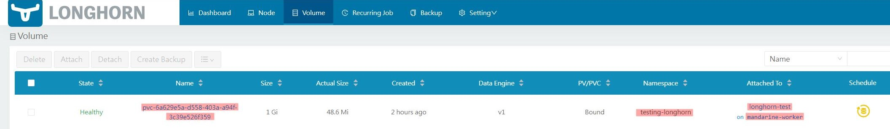
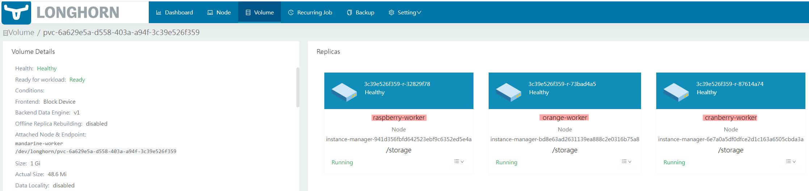

<p align="center">
    
</p>

<hr>

<!-- omit in toc -->
# Distributed Block Storage with Longhorn

K3s, by default, uses a Local Path Provisioner for PersistentVolumeClaims (PVCs), which relies on storage local to the host node. This approach limits data access to the specific node where the pod is running. To overcome this limitation, a distributed block storage system like Longhorn is essential. Longhorn decouples storage from pods, allowing PVCs to be mounted on any pod across the cluster, irrespective of node location.

**Longhorn: A Distributed Block Storage Solution**

Longhorn is a lightweight, reliable, and user-friendly distributed block storage system for Kubernetes. It's a viable alternative to other storage solutions like Rook/Ceph and is compatible with both AMD64 and ARM64 architectures. This compatibility makes it well-suited for a diverse environment such as PiKube Kubernetes cluster with Raspberry Pi and Orange Pi nodes.

<hr>

===
<!-- omit in toc -->
## Table of content

<div style="font-size:larger;">

[<strong>1. Implementation Using Internet Small Computer System Interface (iSCSI)</strong>](#1-implementation-using-internet-small-computer-system-interface-iscsi)

[<strong>2. Addressing Longhorn Issues with Multipath</strong>](#2-addressing-longhorn-issues-with-multipath)

[<strong>3. Longhorn Installation Procedure Using Helm</strong>](#3-longhorn-installation-procedure-using-helm)

[<strong>4. Configuring Access to Longhorn UI with Traefik Ingress</strong>](#4-configuring-access-to-longhorn-ui-with-traefik-ingress)

[<strong>5. Testing Longhorn Storage</strong>](#5-testing-longhorn-storage)

[<strong>6. Configuring Longhorn as the Default Kubernetes StorageClass</strong>](#6-configuring-longhorn-as-the-default-kubernetes-storageclass)

</div>

## **1. Implementation Using Internet Small Computer System Interface (iSCSI)**

Longhorn requires the open-iscsi package on all cluster nodes, with the iscsid daemon running:

- **`Longhorn as iSCSI Target`**: Longhorn functions as an iSCSI Target, creating volumes that are detected by the iSCSI Initiator on each node.

- **`Nodes as iSCSI Initiators`**: Nodes in the cluster are configured as iSCSI Initiators, recognizing Longhorn volumes as block devices under **`/dev/longhorn/`**.

Configure **`iSCSI`** for Longhorn involves installation of **`Open-iscsi`** on each **`Node`** to ensures all nodes can interact with Longhorn volumes using iSCSI.

```bash
sudo apt-get install open-iscsi
```

Configure **`SCSI Initiators`** by excluding default authentication parameters in **`iscsid.conf`** on each **`Node`**. Longhorn's local iSCSI target does not use authentication.

Inside **`iscsid.conf`**, look for lines related to authentication. These might include settings like **`node.session.auth.username`**, **`node.session.auth.password`**, **`discovery.sendtargets.auth.username`**, and **`discovery.sendtargets.auth.password`**.

## **2. Addressing Longhorn Issues with Multipath**

When multipath is active on storage nodes, it can automatically manage block devices, including those created by Longhorn. This might lead to errors when starting Pods that use Longhorn volumes, such as "volume already mounted."

**Solution**: To resolve this, Longhorn devices need to be blacklisted in the multipath configuration. This prevents multipath from managing these devices.

To modify **`Multipath`** configuration, open the **`/etc/multipath.conf`** file on each node where multipath is running, this includes nodes using Longhorn for storage, and add the blacklist command.

```conf
blacklist {
  devnode "^sd[a-z0-9]+"
}
```

This configuration tells multipath to ignore devices matching the specified pattern, which includes Longhorn-managed devices.

After updating the configuration, restart the multipath daemon to apply the changes.

```bash
sudo systemctl restart multipathd
```

## **3. Longhorn Installation Procedure Using Helm**

- On **`gateway`**, add **`Longhorn`**'s Helm Repository

```bash
helm repo add longhorn https://charts.longhorn.io
```

- Fetch the latest charts from the repository to ensure you have the most recent updates

```bash
helm repo update
```

- Create a dedicated namespace for Longhorn in your PiKube Kubernetes cluster

```bash
kubectl --kubeconfig=/home/pi/.kube/config.yaml create namespace longhorn-system
```

- Create a **`longhorn-values.yaml`** file for custom configurations

```yaml
defaultSettings:
  defaultDataPath: "/storage"

ingress:
  enabled: true
  ingressClassName: nginx
  host: longhorn.picluster.quantfinancehub.com
  tls: true
  tlsSecret: longhorn-tls
  path: "/"
  annotations:
    nginx.ingress.kubernetes.io/auth-type: basic
    nginx.ingress.kubernetes.io/auth-secret: nginx/basic-auth-secret
    nginx.ingress.kubernetes.io/service-upstream: "true"
    cert-manager.io/cluster-issuer: letsencrypt-issuer
    cert-manager.io/common-name: longhorn.picluster.quantfinancehub.com
```

📢 This configuration:

➜ Sets **/storage** as the default path for data storage.

➜ Enables and configures an **`Ingress`** resource for accessing the **`Longhorn dashboard`** through **`NGINX`**.

➜ Configures **`basic authentication`** and **`TLS`** for the dashboard using **`Cert-Manager`**.

- Install **`Longhorn`** in the **`longhorn-system`** namespace using **`longhorn-values.yaml`** file

```bash
helm --kubeconfig=/home/pi/.kube/config.yaml install longhorn longhorn/longhorn --namespace longhorn-system -f longhorn-values.yaml
```

📌 **Note**

TODO

*For enabling backup to an S3 storage server, additional backup configurations are required. Refer to the [**`Longhorn backup documentation`**]() for setup details.*

- To confirm that the Longhorn installation has succeeded:

```bash
kubectl --kubeconfig=/home/pi/.kube/config.yaml -n longhorn-system get pod
```

## **4. Configuring Access to Longhorn UI with Traefik Ingress**

To make the **`Longhorn UI`** accessible through a specific URL (longhorn.picluster.quantfinancehub.com) via the **`Traefik Ingress Controller`**, Ingress resources needs to be created. These resources will manage traffic, ensuring secure HTTPS connections and **`redirecting HTTP to HTTPS`**. **`Basic HTTP authentication`** will be implemented for security, as **`Longhorn's frontend`** doesn't provide its own authentication mechanism.

📌 **Note**

*Traefik 2.x has a known issue with WebSocket headers that affects Longhorn UI API calls. Refer to Longhorn's "Troubleshooting Traefik 2.x as an ingress controller" documentation for solutions.*

- Create a **`longhorn_ingress.yaml`** file

  - **`API Issue Mitigation with Custom Headers`**: Setting custom request headers to support WebSocket connections.

  - **`HTTPS Ingress Resource`**: Configuring Ingress to utilize HTTPS, enable TLS, and apply necessary middleware.

  - **`HTTP Ingress for Redirection`**: Defining an additional Ingress resource to redirect HTTP traffic to HTTPS.

```yaml
# Solving the API issue with custom headers for WebSocket support
---
apiVersion: traefik.containo.us/v1alpha1
kind: Middleware
metadata:
  name: svc-longhorn-headers
  namespace: longhorn-system
spec:
  headers:
    customRequestHeaders:
      X-Forwarded-Proto: "https"

# HTTPS Ingress Resource
---
apiVersion: networking.k8s.io/v1
kind: Ingress
metadata:
  name: longhorn-ingress
  namespace: longhorn-system
  annotations:
    # Define HTTPS as the entry point
    traefik.ingress.kubernetes.io/router.entrypoints: websecure
    # Enable TLS
    traefik.ingress.kubernetes.io/router.tls: "true"
    # Reference Middleware for Basic Auth and custom headers
    traefik.ingress.kubernetes.io/router.middlewares:
      traefik-basic-auth@kubernetescrd, longhorn-system-svc-longhorn-headers@kubernetescrd
    # Enable automatic SSL certificate creation and storage in a Secret via cert-manager
    cert-manager.io/cluster-issuer: picluster-ca-issuer
    cert-manager.io/common-name: longhorn.picluster.quantfinancehub.com
spec:
  tls:
    - hosts:
        - longhorn.picluster.quantfinancehub.com
      secretName: storage-tls
  rules:
    - host: longhorn.picluster.quantfinancehub.com
      http:
        paths:
          - path: /
            pathType: Prefix
            backend:
              service:
                name: longhorn-frontend
                port:
                  number: 80

# HTTP Ingress for HTTP -> HTTPS Redirection
---
kind: Ingress
apiVersion: networking.k8s.io/v1
metadata:
  name: longhorn-redirect
  namespace: longhorn-system
  annotations:
    # Use Middleware for redirection
    traefik.ingress.kubernetes.io/router.middlewares: traefik-redirect@kubernetescrd
    # Define HTTP as the entrypoint
    traefik.ingress.kubernetes.io/router.entrypoints: web
spec:
  rules:
    - host: longhorn.picluster.quantfinancehub.com
      http:
        paths:
          - path: /
            pathType: Prefix
            backend:
              service:
                name: longhorn-frontend
                port:
                  number: 80
```

- Deploy the Ingress configuration

```bash
kubectl --kubeconfig=/home/pi/.kube/config.yaml apply -f longhorn-ingress.yaml
```

💡 **Additional Considerations**

- **`Custom Domains and DNS`**: Ensure **`longhorn.picluster.quantfinancehub.com`** is correctly mapped to your Traefik Load Balancer's external IP via DNS.

- **`Certificate Management`**: The **`ca-issuer`** should be correctly configured in PiKube Kubernetes cluster to issue certificates for **`longhorn.picluster.quantfinancehub.com`**.

- **`Authentication`**: If not already done, create and configure the **`traefik-basic-auth`** Middleware with the desired credentials.

- **`Testing`**: After applying the configuration, test accessing **`longhorn.picluster.quantfinancehub.com`**. A redirection to HTTPS will be done, and prompted for basic authentication credentials.

## **5. Testing Longhorn Storage**

To verify that **`Longhorn storage`** is functioning correctly, create a **`PersistentVolumeClaim (PVC)`** using Longhorn as the storage class and then deploy a Pod that utilizes this PVC. Here's how to perform this test:

📌 **Note**

*An Ansible playbook has been developed to automate the creation of this testing Pod. It's located at roles/longhorn/test_longhorn.yaml.*

- Create a dedicated namespace for the testing resources

```bash
kubectl --kubeconfig=/home/pi/.kube/config.yaml create namespace testing-longhorn
```

- Define a PersistentVolumeClaim and a Pod in **`longhorn-test.yaml`** file:

```yaml
---
apiVersion: v1
kind: PersistentVolumeClaim
metadata:
  name: longhorn-pvc
  namespace: testing-longhorn
spec:
  accessModes:
    - ReadWriteOnce
  storageClassName: longhorn
  resources:
    requests:
      storage: 1Gi

---
apiVersion: v1
kind: Pod
metadata:
  name: longhorn-test
  namespace: testing-longhorn
spec:
  containers:
    - name: longhorn-test
      image: nginx:stable-alpine
      imagePullPolicy: IfNotPresent
      volumeMounts:
        - name: longhorn-pvc
          mountPath: /data
      ports:
        - containerPort: 80
  volumes:
    - name: longhorn-pvc
      persistentVolumeClaim:
        claimName: longhorn-pvc
```

This file describes a PersistentVolumeClaim for Longhorn storage and a test Pod using Nginx image to utilize the claimed volume.

- Deploy the PersistentVolumeClaim and Pod

```bash
kubectl --kubeconfig=/home/pi/.kube/config.yaml apply -f longhorn-test.yaml
```

- Verify that the Pod has been successfully started:

```bash
kubectl --kubeconfig=/home/pi/.kube/config.yaml get pods -o wide -n testing-longhorn
```

- Ensure that the PersistentVolume (PV) and PersistentVolumeClaim (PVC) have been successfully created

```bash
kubectl --kubeconfig=/home/pi/.kube/config.yaml get pv
kubectl --kubeconfig=/home/pi/.kube/config.yaml get pvc -n testing-longhorn
```

- Access the Pod's shell and write a test file to the persistent volume

```bash
kubectl --kubeconfig=/home/pi/.kube/config.yaml -n testing-longhorn exec -it longhorn-test -- sh -c "echo 'Hello Longhorn' > /data/test.txt"
```

- Confirm that the file was written successfully

```bash
kubectl --kubeconfig=/home/pi/.kube/config.yaml -n testing-longhorn exec -it longhorn-test -- cat /data/test.txt
```

- Delete the Pod to simulate a failure

```bash
kubectl --kubeconfig=/home/pi/.kube/config.yaml -n testing-longhorn delete pod longhorn-test
```

Re-deploy the Pod (it will re-attach to the existing PVC)

```bash
kubectl --kubeconfig=/home/pi/.kube/config.yaml apply -f longhorn-test.yaml
```

- Once the Pod is back up, check the file again

```bash
kubectl --kubeconfig=/home/pi/.kube/config.yaml -n testing-longhorn exec -it longhorn-test -- cat /data/test.txt
```

The output should still be Hello Longhorn, confirming that the data persisted across Pod restarts.

💡 **Additional Considerations**

- **Monitoring and Logs**: Monitor the Pod and Longhorn system logs for any errors or issues.

- **Volume Size**: Adjust the requested storage size in the PVC according to your needs and available resources.

- **Cleanup**: Remember to delete the testing resources after you're done to free up space and resources.

- Check in the longhorn-UI the created volumes and the replicas

<p align="center">
    
</p>

<p align="center">
    
</p>

## **6. Configuring Longhorn as the Default Kubernetes StorageClass**

🚨 **Important Note**

This step is not necessary if K3s is installed with the Local Path Provisioner disabled (using the **`--disable local-storage`** installation option). If this option wasn't set during installation, follow the procedure below.

**Background**:

By default, K3s includes Rancher's Local Path Provisioner, enabling the immediate creation of Persistent Volume Claims using local storage on the respective node.

To utilize Longhorn as the default storage class for new Helm installations, the Local Path Provisioner must be reconfigured.

**Checking Default Storage Classes**:

- After installing Longhorn, verify the default storage classes

```bash
kubectl --kubeconfig=/home/pi/.kube/config.yaml get storageclass
```

something like might be visible

```lua
NAME                 PROVISIONER             RECLAIMPOLICY   VOLUMEBINDINGMODE      ALLOWVOLUMEEXPANSION   AGE
local-path (default) rancher.io/local-path   Delete          WaitForFirstConsumer   false                  10m
longhorn (default)   driver.longhorn.io      Delete          Immediate              true                   3m27s
```

Notice that both Local-Path and Longhorn are marked as default storage classes.

**Changing the Default Storage Class**:

To remove the Local Path as the default and set Longhorn as the sole default storage class, execute the following command:

```bash
kubectl --kubeconfig=/home/pi/.kube/config.yaml patch storageclass local-path -p '{"metadata": {"annotations":{"storageclass.kubernetes.io/is-default-class":"false"}}}'
```

This command updates the Local Path Provisioner, ensuring that Longhorn is recognized as the default storage class for any subsequent deployments.

**Verification**:

- Confirm the change by rechecking the storage classes:

```bash
kubectl --kubeconfig=/home/pi/.kube/config.yaml get storageclass
```

Now only Longhorn is marked as the default.

Full procedure is explained in [**`Kubernetes documentation`**](https://kubernetes.io/docs/tasks/administer-cluster/change-default-storage-class/).

💡 **Additional Considerations**

- **`Helm Installations`**: After setting Longhorn as the default storage class, any new Helm installations will automatically use it for dynamic volume provisioning.

- **`Existing PVCs`**: This change won't affect existing PVCs. If needed, to migrate existing PVCs to Longhorn, a manual transfer of the data is required or recreate the PVCs.

- **``Cluster Configuration``**: Always ensure the cluster configuration and node resources align with Longhorn's requirements for optimal performance and stability.

